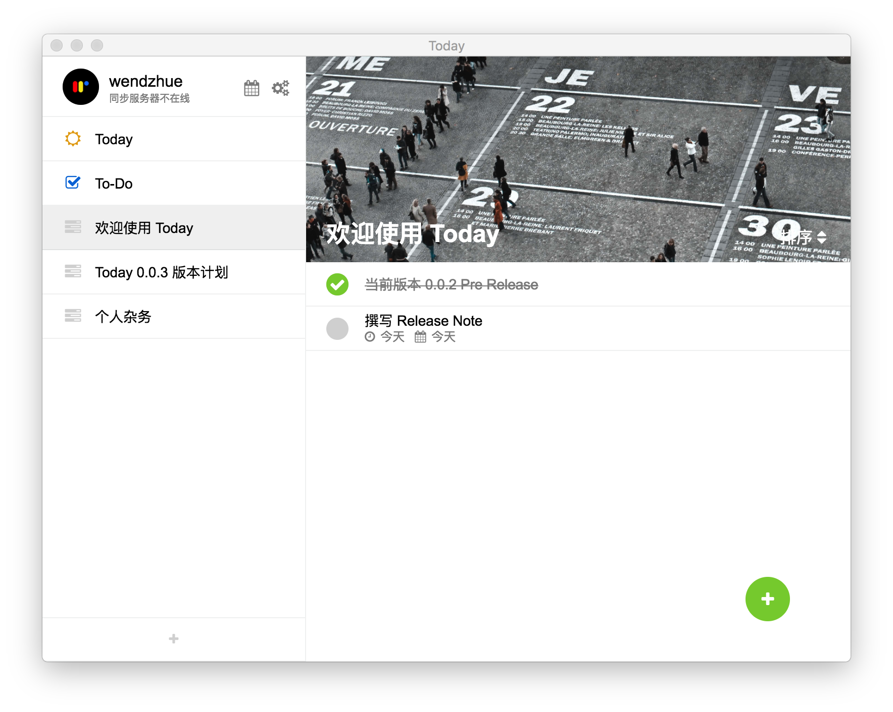
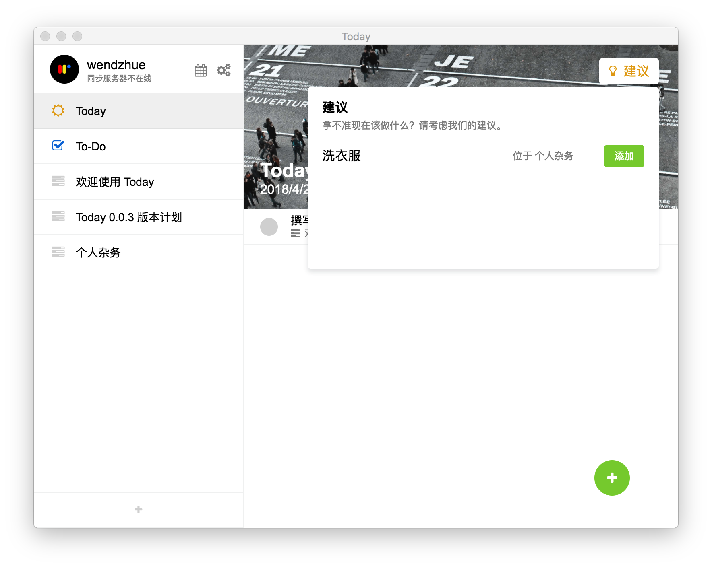
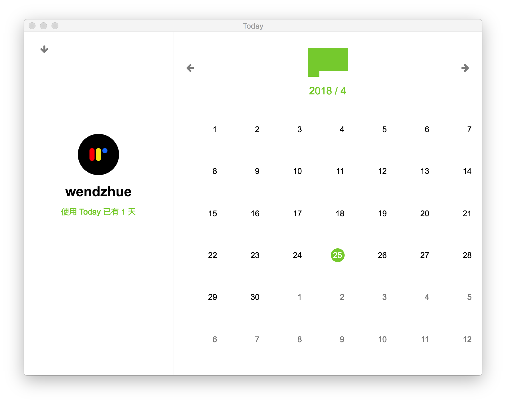

# Today

> 一个帮助你记录任务，总结今日的 GTD 应用。

Today 是一个基于 Electron 和 Vue.js 的跨平台的 GTD 应用。它能够帮助你记录任务，为今天的日程提供建议，并且评估你的生产力。

你可以用 Today 做这些事情：

* 增加待办事项，设置 deadline 以及你计划要做这项任务的时间，你还可以写一些笔记。
* 从 Today 获取今日应该做什么事的建议。
* 设置提醒，这样 Today 就会在计划时间提醒你去做这件事情。
* 评估你完成计划任务的效率。

Today 现在支持中英文。

## 获取使用

这个项目目前还在开发当中，如果你感兴趣，可以在 release 页面下载为 Mac 用户提供的预览版本。你也可以克隆这个 repo 然后：

* `yarn dev` 以在开发环境下运行。
* `yarn storybook` 来开发组件。
* `yarn build` 构建应用。

请通过 `electron-vue` 获取更多关于开发和构建的信息。

## 组件

为了提供顺畅的交互和优秀的使用体验，我写了当中需要用到的全部组件，正计划把它们做成一个独立的项目。

* Calendar 日历
* ContextMenu 右键菜单
* DatePicker 日期选择器，现在也可以选择时间
* Message 消息
* Notfication 通知
* Input 输入框
* Button 按钮
* ConfirmDialog 确认对话框
* InputDialog Prompt 对话框
* Dropdown 弹出框
* Modal 模态框
* Segment 分类选择
* Switch 开关
* Select 选择列表

它们在 `src/renderer/components/wzel` 底下。

## Roadmap

还有很多工作需要完成！如果你感兴趣的话，不管你是前端开发者、后端开发者、还是设计师、动效师，只要你想要做一个社区支持的 GTD 应用，或者仅仅是为了提高自己的专业水平，都欢迎你加入我。

### 0.0.3

0.0.3 版本仍将是一个 pre release 版本，这个版本的主要计划包括：

#### 功能

* 在为用户提供建议的时候，采取更多的推荐策略
* 获取天气信息，在 Today 页面进行展示，这样用户在决定今天做什么的时候就可以进行参考
* 给待办事项列表提供 Emoji 的选择
* 将代办事项移动到其他列表当中

#### UI

* 绘制插画风的图片以形成统一的 UI 风格

#### 维护

* 增加日志模块

---

Wendell Hu, 2018.
