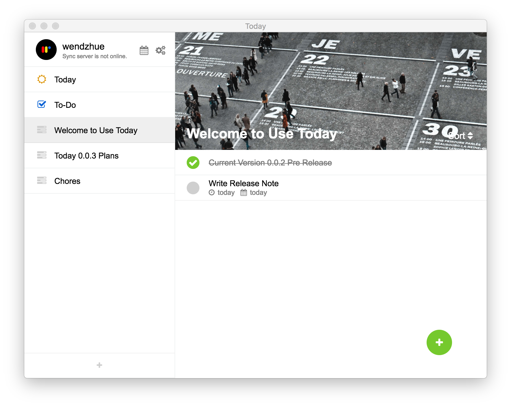
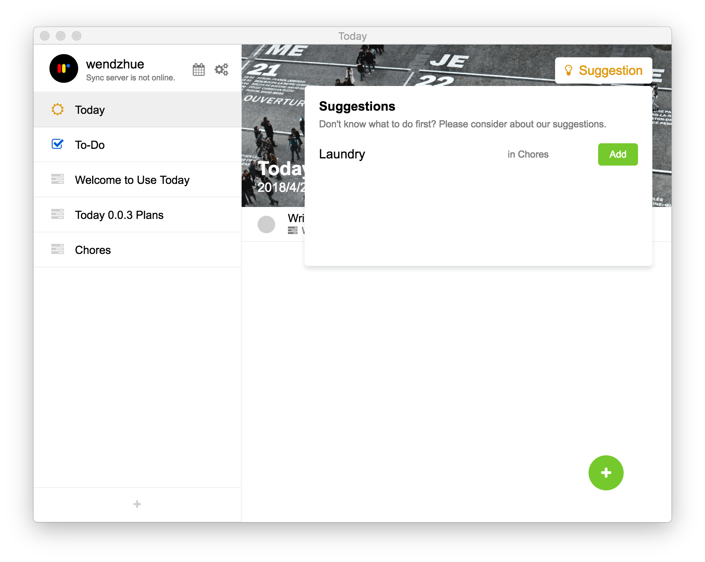
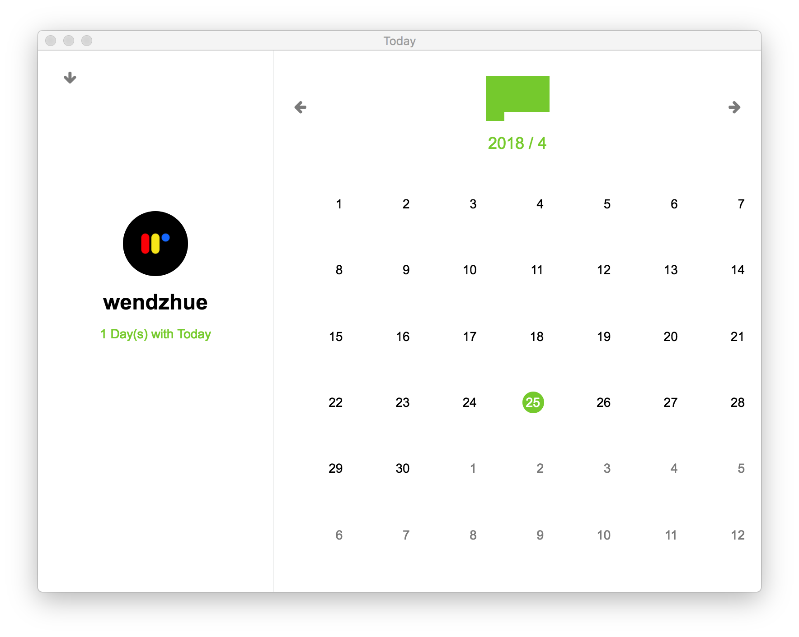

# Today

> An app helps you to remember things and evaluates your productivity. WIP.

[中文说明](../README-CN.md)

Today is a cross-platform GTP application built on the power of Electron and Vue.js and with :heart:. It helps you to keep track of your tasks, provide suggestions for today and evaluate how productive you are.

A glance of what you can do with Today:

* Add a To-Do, set due date and plan date, and write a description.
* Get suggestions from Today for today's jobs.
* See if you complete your planned To-Dos in Summary View.

Today now supports English and Chinese.

## How to use

This project is still a work in progress But if you're interested, you can go to releases and download the latest preview release. You can also clone this repo and:

* `yarn dev` to run in development mode.
* `yarn storybook` to develop components.
* `yarn build` to build.

Please refer to `electron-vue` for more running and building guides.

## Components

I wrote all components to provide smooth interactions and refreshing user experience.

* Calendar
* ContextMenu
* DatePicker
* Message
* Notfication
* Input
* Button
* ConfirmDialog
* InputDialog
* Dropdown
* Modal
* Segment
* Switch
* Select

See them in `src/renderer/components/wzel`.

---

Wendell Hu, 2018.
