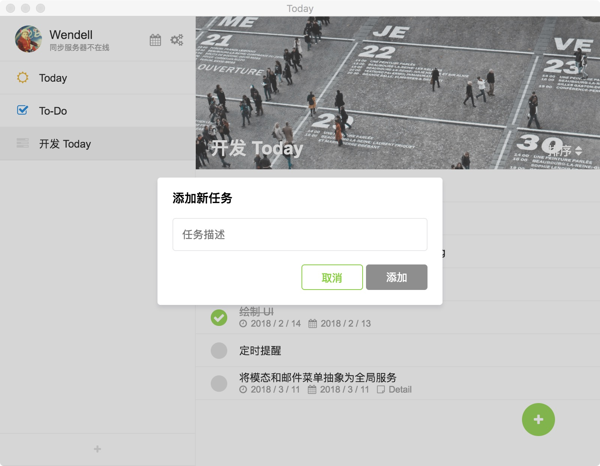
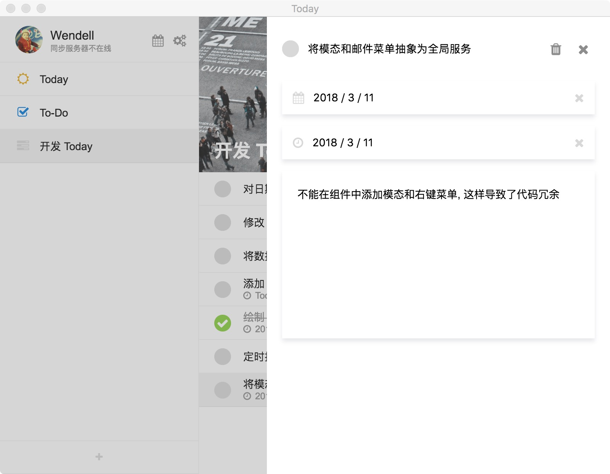
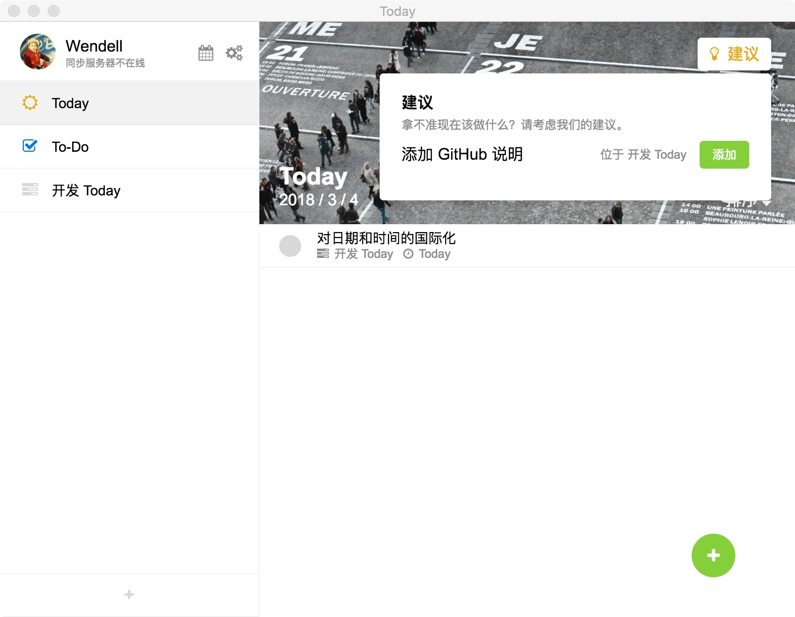
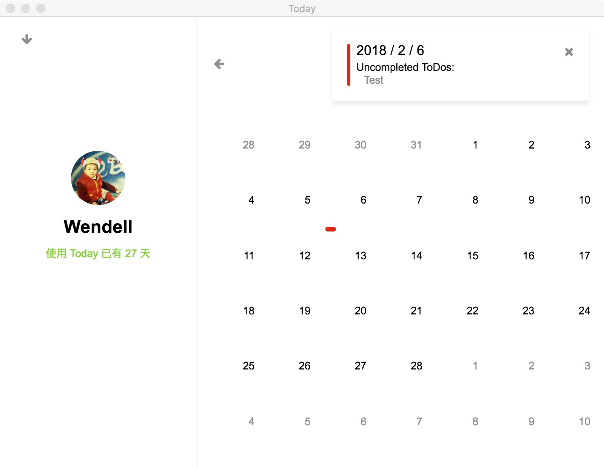

# Today

> An app helps you to remember things and do them quiet in time. WIP.

Today is a cross-platform GTP application built on the power of Electron and Vue.js and with :heart:. It helps you to keep track of your tasks, provide suggestions for today and evaluate how productive you are. I wrote all components to provide smooth interactions and refreshing user experience.

A glance of what you can do with Today:

* Add a ToDo, set due date and plan date, and write a description.
* Get suggestions from Today for today's jobs.
* See if you complete your planned ToDos in Summary View.

Today now supports English and Chinese.

## How to use

This project is still a work in progress so I don't have a release for you. If you're interested, you have to clone this repo and run the following scripts:

* `yarn dev` to run in development mode.
* `yarn storybook` to develop components.
* `yarn build` to build.

Please refer to `electron-vue` for more running and building guides.

## Components

I have written some components for this project, include:

* Calendar
* ContextMenu
* DatePicker
* Message
* Notfication
* Input
* Button
* ConfirmDialog
* InputDialog
* Dropdown
* Modal
* Segment
* Switch
* Select

They are in `src/renderer/components`.

---

Wendell Hu, 2018.
