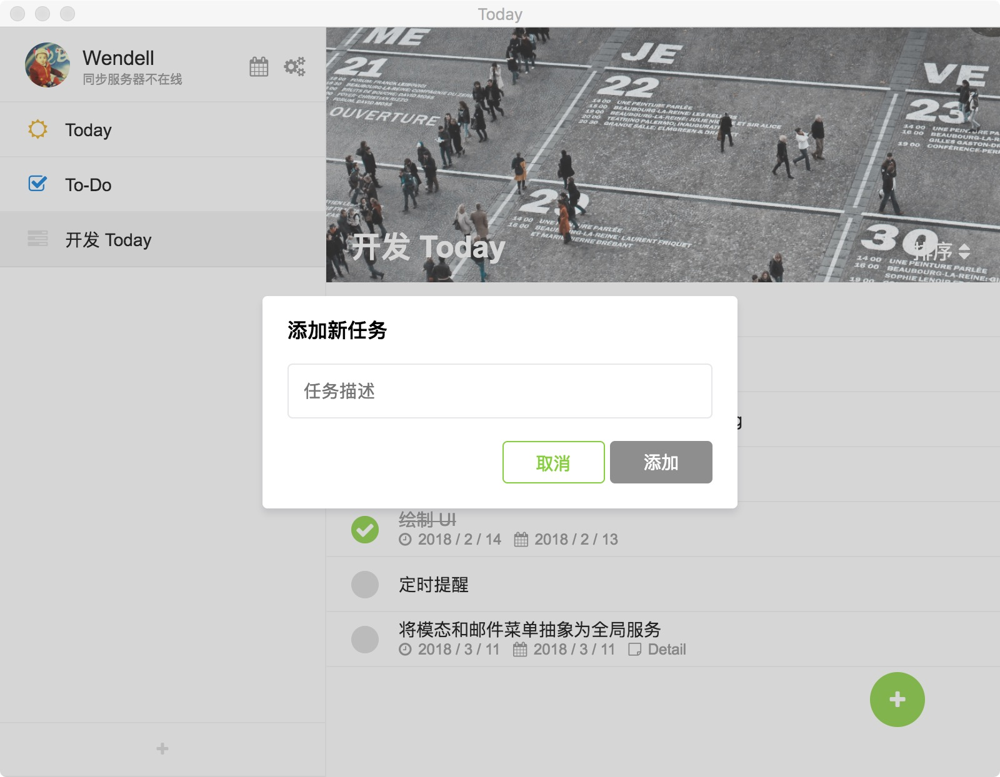
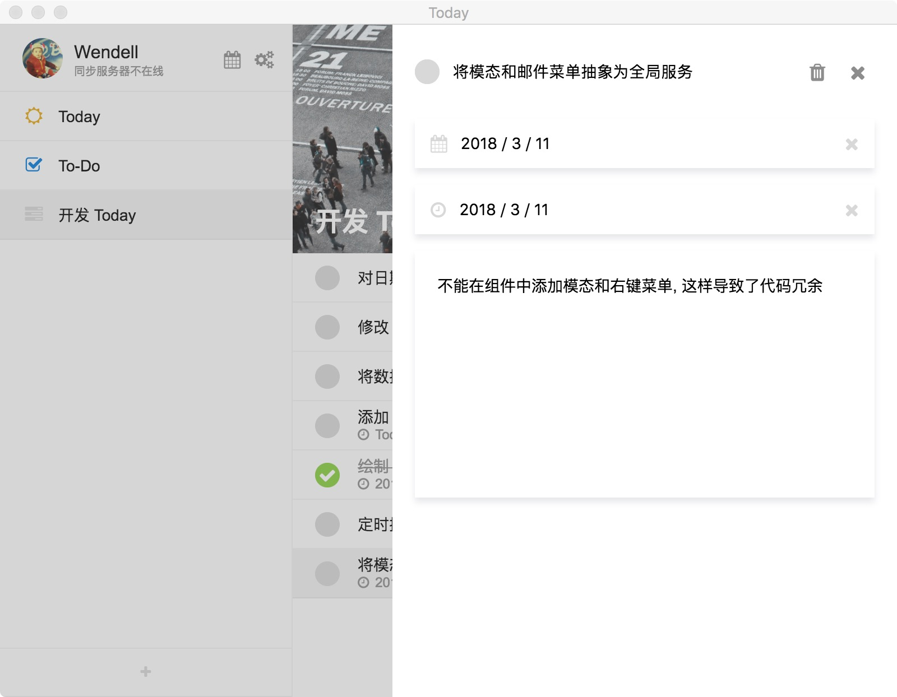
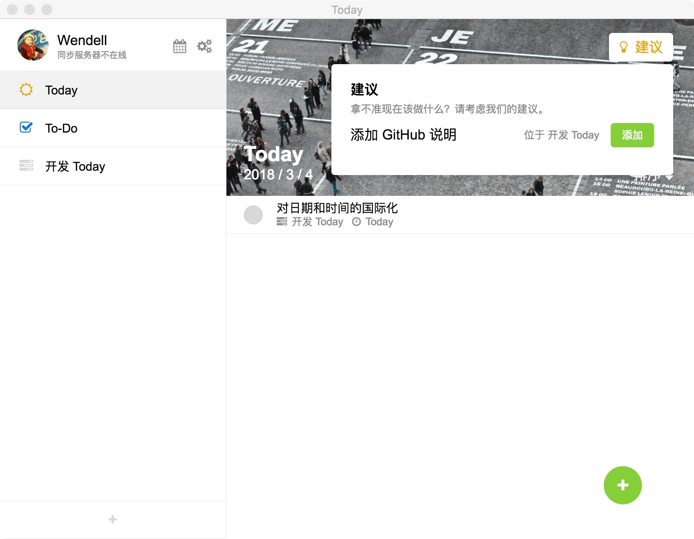
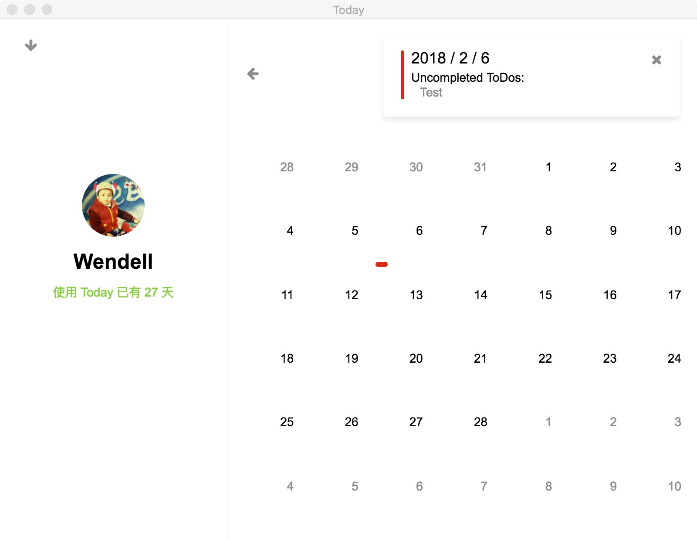

# Today

> An app helps you to remember things and do them quiet in time. WIP.

Today is a cross-platform GTP application built on the power of Electron and Vue.js and with :heart:. It helps you to keep track of your tasks, provide suggestions for today and evaluate how productive you are. I wrote all components to provide smooth interactions and refreshing user experience.

A glance of what you can do with Today:

* Add a ToDo, set due date and plan date, and write a description.
* Get suggestions from Today for today's jobs.
* See if you complete your planned ToDos in summary view.

## How to use it

This project is still a work in progress so I don't have a release for you. If you're interested, you can clone this repo, install dependencies and run `npm run dev`.

---

Wendell Hu, 2018.
